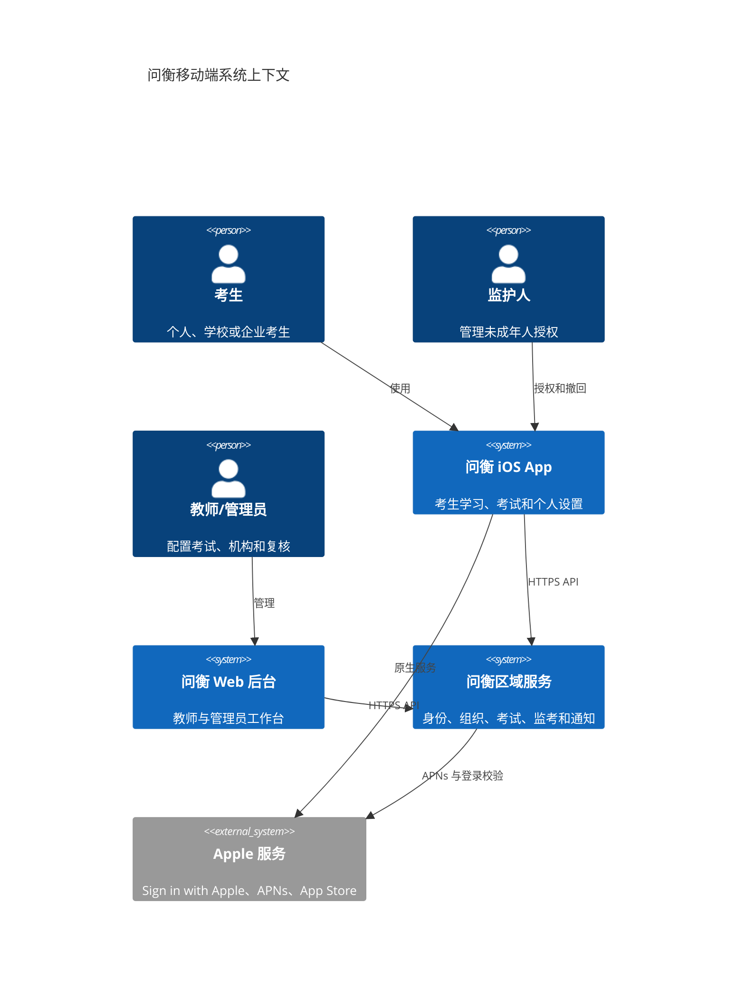
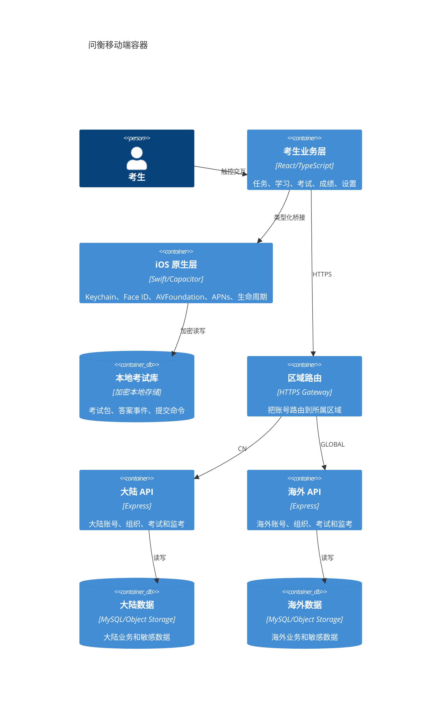
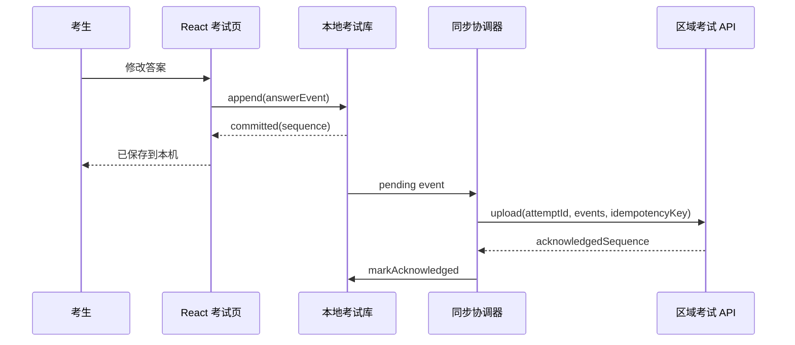
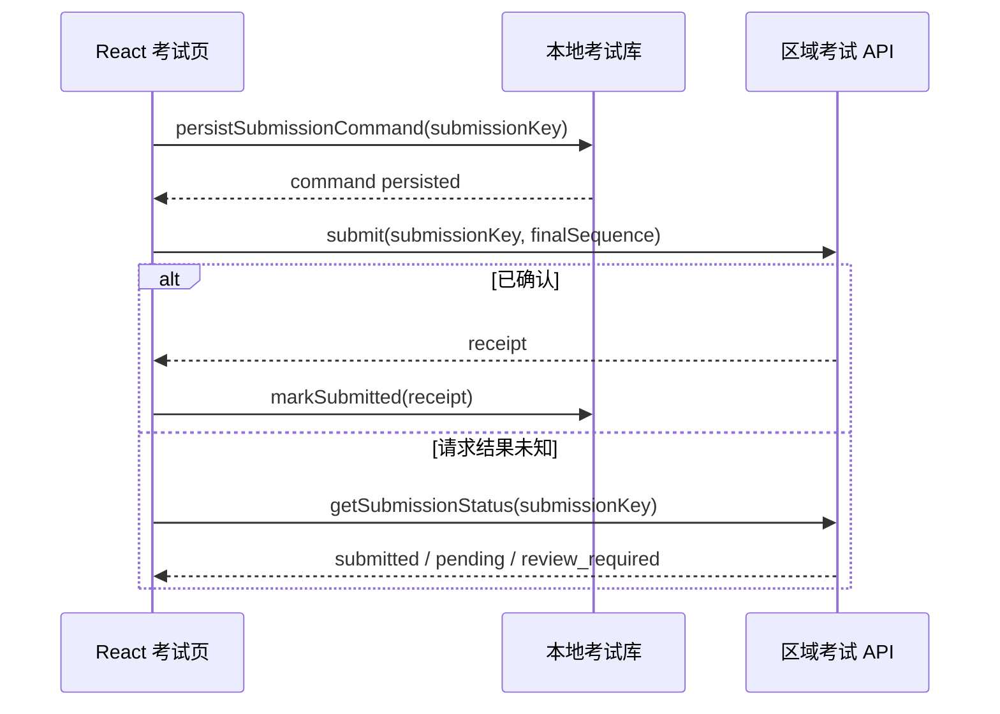

# 问衡移动端架构视图

> 版本：1.0
> 日期：2026-08-30
> 受众：产品、技术负责人、客户端、服务端、测试与运维
> 范围：iOS 考生端及其依赖的区域化服务

## 概览

问衡移动端是在现有 React、Express 和 MySQL 系统上新增的正式考生产品。它保留教师与管理员 Web 后台，通过 Capacitor 8 把移动考生业务承载到 iOS，并使用 Swift 实现安全会话、可靠考试、原生监考、推送和系统生命周期能力。

系统使用一个 Bundle ID `top.qisw.wenheng`。中国大陆与海外共享客户端代码和业务契约，但账号、答卷、人脸核验、监考材料、密钥和日志默认分别处理和存储。

## 系统上下文

## 容器视图

## iOS 组件视图

| 组件 | 输入 | 输出 | 责任边界 |
|---|---|---|---|
| Mobile Router | App 构建目标、认证状态、用户角色 | 考生路由树 | iOS 不暴露教师或管理员后台 |
| Runtime Provider | App/Network 原生事件 | 前后台和网络状态 | 统一 Web 与 iOS 的运行时差异 |
| Secure Session | 会话读写命令 | 内存访问令牌、Keychain 状态 | 长期凭证不进入 localStorage |
| Exam Session Store | 考试包、答案事件、提交命令 | 原子持久化结果 | 先本地保存，再允许界面确认 |
| Sync Coordinator | 待同步事件、网络状态 | 服务端确认序号 | 幂等重试和冲突显式处理 |
| Proctoring Runtime | 考试策略、用户同意、权限 | 传感器状态、事实事件、有限快照 | 不进行客户端作弊裁决 |
| Notification Router | APNs 负载、认证状态 | 受控应用内深链 | 锁屏不暴露敏感详情 |
| Privacy Controller | 区域、年龄段、同意状态 | 能力开关与删除请求 | 敏感能力无有效依据时关闭 |

## 关键数据流

### 作答与同步

### 交卷

## 部署视图

- iOS 二进制：单一 App Store 应用记录，按地区分批开放。
- 大陆服务：大陆 API、MySQL、对象存储、Redis、日志与密钥。
- 海外服务：海外 API、MySQL、对象存储、Redis、日志与密钥。
- 区域路由：只处理最小账号路由信息，不汇聚敏感业务数据。
- Web 后台：访问登录用户所属区域；跨区运营使用分别授权的后台入口。

## 架构决策链接

- 产品需求：`docs/requirements/requirements-wenheng-mobile-product.md`
- 最终设计：`docs/superpowers/specs/2026-08-30-wenheng-mobile-product-design.md`
- 移动 Web 基础：`docs/superpowers/specs/2026-08-30-wenheng-mobile-foundation-design.md`

## 参考资料

- [Capacitor 8 iOS](https://capacitorjs.com/docs/ios)
- [Capacitor 自定义 iOS 代码](https://capacitorjs.com/docs/ios/custom-code)
- [Apple App Review Guidelines](https://developer.apple.com/app-store/review/guidelines/)
