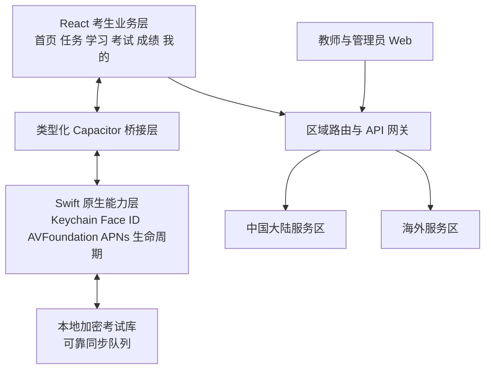
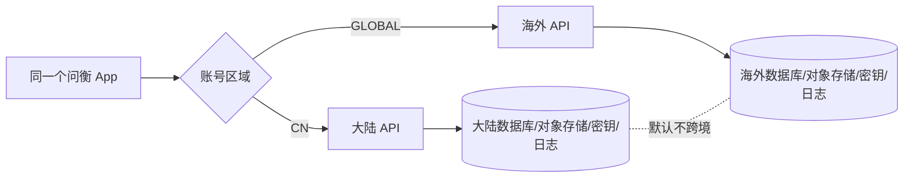
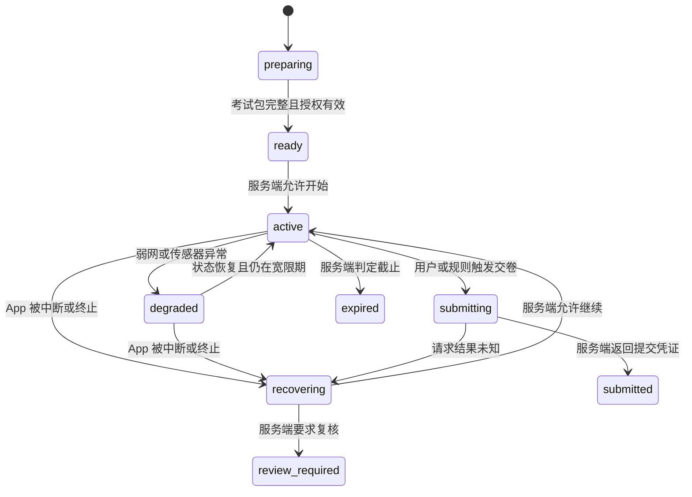

# 问衡移动端最终产品设计

> 版本：1.0
> 状态：已确认
> 日期：2026-08-30
> 作者：项目所有者、Codex
> 需求基线：`docs/requirements/requirements-wenheng-mobile-product.md`

## 1. 目标

在保留现有教师与管理员 Web 后台的前提下，把已经完成移动 Web 基础的考生端升级为可长期运营、可在 App Store 发布的 iOS 产品。首发同时服务个人学习者、学校和企业考生，覆盖中国大陆与海外地区，并为后续 Android 原生容器保留稳定接口。

“完成”不以 WebView 能打开为标准。正式产品必须具备原生安全会话、可靠答题、进程恢复、原生监考、区域数据边界、账号注销、未成年人保护、推送、真机质量门槛和完整审核材料。

## 2. 产品身份与平台约束

- 品牌：问衡。
- 定位：AI 智能测评与学习平台。
- 口号：以问见知，以衡见长。
- iOS Bundle ID：`top.qisw.wenheng`。
- 最低版本：iOS 16。
- 设备：iPhone 全尺寸，同功能兼容 iPad。
- 首发价格：免费，不接入 StoreKit，不展示外部购买数字权益入口。
- 管理边界：教师和管理员继续使用 Web 后台，iOS 首版只交付考生产品。
- 发行区域：中国大陆与海外使用同一个 App Store 应用记录和客户端代码，但服务与数据分区。

## 3. 非目标

- 不在首发 iOS App 内复制组卷、出题、组织管理、审批流等桌面后台。
- 不默认持续录制或上传摄像头视频、麦克风音频。
- 不用人脸作为手机端账号登录方式；系统 Face ID 只用于本机解锁会话。
- 不在首发接入广告、IDFA、会员订阅或营销推送。
- 不自动跨区合并中国大陆与海外账号和敏感数据。
- 不承诺 iOS 无法保证的绝对禁止截屏、录屏或切换 App。

## 4. 总体架构

采用“React 考生业务层 + Capacitor 8 原生容器 + Swift 关键能力”的混合原生架构。React 复用现有领域逻辑和已完成的移动页面；Swift 负责 Keychain、LocalAuthentication、AVFoundation、APNs、生命周期、本地加密存储和隐私能力；两层只通过类型明确、最小权限的桥接接口交互。

### 4.1 客户端组件

| 组件 | 技术 | 职责 |
|---|---|---|
| 考生业务层 | React 19、TypeScript、React Router | 注册登录、任务、学习、考试、成绩、设置和隐私流程 |
| 原生容器 | Capacitor 8、WKWebView | iOS 生命周期、原生插件承载、构建与商店分发 |
| 会话桥接 | Swift、Security.framework | Keychain 保存和读取会话，不向页面暴露长期凭证存储细节 |
| 考试会话桥接 | Swift、本地加密存储 | 考试包、答案事件、提交命令和待同步队列 |
| 监考桥接 | Swift、AVFoundation | 权限、身份核验、传感器状态、有限快照和事实事件 |
| 系统能力 | APNs、LocalAuthentication、Network、App | 推送、Face ID 解锁、网络与前后台事件 |

### 4.2 服务端组件

现有 Express API 与 MySQL 继续作为业务基础，按领域增加而不是建立第二套移动后端：

- 身份与会话：稳定用户标识、多登录身份、原生刷新会话、重新认证、注销。
- 区域与租户：账号区域路由、机构区域、组织成员关系和跨区拒绝策略。
- 考试会话：考试授权、服务端时间锚点、答案事件确认、恢复裁决和幂等交卷。
- 监考：考试监考策略、同意凭证、事件、有限材料和人工复核状态。
- 通知：设备令牌、通知偏好、APNs 投递、深链和投递审计。
- 权益：首发只返回免费与机构授权；保留后续 StoreKit entitlement 接口。

## 5. 客户端信息架构

底部导航固定为：首页、任务、学习、我的。考试页使用独立沉浸式布局，不显示后台侧栏、页签、AI 浮窗或底部导航。

- 首页：下一场考试、待办任务、同步状态、学习概览。
- 任务：待开始、进行中、待恢复、已完成。
- 学习：练习、错题、收藏、题库、学习统计。
- 我的：机构切换、账号安全、通知、权限、隐私、监护人授权、数据导出和注销。

首次启动只进行品牌引导、地区选择和登录或注册，不请求摄像头、麦克风或通知权限。敏感权限只在用户进入明确需要该能力的考试或设置入口时请求。

## 6. 区域与数据边界

个人注册时由用户明确选择国家或地区；系统语言和 IP 只能推荐。机构账号由机构或邀请码确定区域。区域一经创建不能由客户端任意切换。

全局目录最多保存用户区域路由所需的不可逆或最小映射，不复制人脸、答卷、成绩、监考快照和连续行为数据。跨区考试或账号关联在产品默认路径中关闭，只有完成单独的数据流和合规评审后才能为指定租户开放。

## 7. 账号与登录

- 用户使用稳定全局标识；邮箱、E.164 手机号、用户名、Apple subject、Google subject 是可绑定身份。
- 大陆个人用户支持手机号验证码和邮箱密码；机构用户支持机构账号、临时密码或邀请码认领。
- 海外个人用户支持邮箱密码、Sign in with Apple 和 Google。
- GitHub 和自建人脸登录不进入 iOS 首发。
- 机构邀请命中已验证身份时只新增组织成员关系，不创建重复用户。
- 合并已有账号必须分别重新认证并生成审计记录；不按姓名、相似邮箱、设备或人脸自动合并。
- Face ID 使用 LocalAuthentication 解锁本机已存在会话，App 不读取系统生物特征。
- 支持找回密码、登录身份绑定与解绑、重新认证、数据导出和应用内账号注销。

## 8. 可靠考试会话

### 8.1 状态机

### 8.2 保存与同步

- 每个答案事件包含 `attemptId`、`sequence`、`questionId`、`revision`、答案负载、客户端单调时间和校验值。
- 事件先原子写入本地加密存储，再更新界面状态，并通过幂等批次上传。
- 服务端返回最后确认序号和冲突状态；客户端不能静默覆盖更新版本。
- 计时使用服务端时间锚点和设备单调时钟，修改系统时间不改变考试截止时间。
- 交卷命令包含唯一 `submissionKey`；超时后查询命令状态，不能重复创建答卷或提前显示成功。
- 普通考试可配置必须在线或允许短时离线。严格监考必须联网开始并维持心跳，超过宽限期后进入受控暂停或人工复核。

## 9. 严格监考

- 考前先展示采集项目、目的、数据去向、保留期限和拒绝后果，再分别请求权限。
- 摄像头只用于身份核验、人脸在场、多人、遮挡、光线和画面中断检测。
- 麦克风首发只检查授权、设备可用性和采集轨道中断，不保存或上传音频内容。
- 首发只上传必要事件和有限快照或核验结果，不持续上传完整音视频。
- 监考期间持续显示“监考中”及当前传感器状态。
- 客户端只记录事实事件；是否允许继续、暂停、作废或人工复核由服务端考试策略决定。
- 未来完整音视频录像属于单独高风险企业能力，不在本设计范围内。

## 10. 未成年人保护

- 中国大陆未满 14 周岁用户不能独立完成个人注册，需监护人完成专门规则同意。
- 学校导入账号不等于取得人脸处理同意；系统提供监护人邀请、告知、同意、撤回和审计闭环。
- 未成年人严格人脸监考默认关闭；启用前需要针对具体目的的监护人同意，并提供人工或线下替代方案。
- 不投放广告，不使用儿童信息进行画像或营销。
- 海外按账号区域应用当地年龄门槛和监护人规则。

## 11. 安全与隐私

- 长期会话材料存入 Keychain；React 只使用启动时注入内存的短期访问令牌。
- 本地考试数据使用独立密钥加密、启用 iOS 文件保护并排除普通备份。
- App 进入后台时遮盖考试内容，避免任务切换器预览泄露题目。
- 日志与崩溃报告不记录令牌、完整答案、人脸图片、音频内容或未成年人身份信息。
- 不接入广告追踪和 IDFA。
- 注销立即撤销会话；需要保留的数据进入限制处理并按期限自动删除。
- `PrivacyInfo.xcprivacy`、`Info.plist` 用途文案、App Store 隐私标签和应用内政策必须与真实数据流一致。

## 12. 推送与深链

APNs 首发支持任务下发、开考前 24 小时和 1 小时提醒、成绩或复核结果、考试变更和账号安全通知。锁屏正文不包含完整成绩、人脸结果或违规详情。点击通知后先恢复或重新认证会话，再跳转到目标页面。

营销、会员促销和每日打卡不进入首发。通知权限不是 App 基础功能的前置条件。

## 13. 错误处理原则

每个错误界面必须同时回答：发生了什么、答案是否安全、用户下一步能做什么。状态使用稳定错误码驱动，不能依赖服务端自由文本判断业务。

关键错误包括：区域不匹配、会话过期、考试包损坏、本地空间不足、弱网、同步冲突、交卷结果未知、权限拒绝、传感器占用、监考中断和服务端要求人工复核。

## 14. 分阶段实施

1. 原生容器：Capacitor/Xcode、iOS 专用路由、Keychain 会话、网络和生命周期。
2. 账号与区域：稳定身份、多登录方式、区域路由、机构认领、未成年人同意、注销。
3. 可靠考试会话：服务端 attempt、加密本地库、答案事件同步、恢复和幂等交卷。
4. 原生监考：AVFoundation、同意凭证、事实事件、有限快照和人工复核。
5. 推送与发布：APNs、深链、隐私清单、真机矩阵、TestFlight 和审核材料。

每个阶段必须产出可独立测试的软件，未通过阶段验收不得用后续界面掩盖底层缺口。

## 15. 验收与发布门槛

- 注册、登录、加入机构、下载考试、作答、恢复、交卷和注销关键流程全部通过。
- 不存在未关闭的 P0 或 P1 缺陷。
- 断网、杀进程和交卷超时重复测试中答案静默丢失为 0。
- 本地保存反馈目标不超过 300 毫秒。
- TestFlight 达到足够样本后，无崩溃会话不低于 99.5%。
- 最小屏 iPhone、主流和最大尺寸 iPhone、代表性 iPad，以及 iOS 16 到提交时最新正式版均完成覆盖。
- 隐私、未成年人、备案、组织主体和审核演示材料完成后才能提交 App Store。

## 16. 架构决策

| 编号 | 决策 | 结果 |
|---|---|---|
| DR-001 | 客户端技术路线 | React + Capacitor + Swift 关键模块 |
| DR-002 | iOS 最低版本 | iOS 16 |
| DR-003 | 应用标识 | `top.qisw.wenheng` |
| DR-004 | 发行拓扑 | 单 App、双区域、敏感数据默认不跨境 |
| DR-005 | 账号模型 | 全局用户与多登录身份分离，组织成员关系独立 |
| DR-006 | 考试可靠性 | 本地先写、事件同步、服务端最终裁决 |
| DR-007 | 监考采集 | 事件和有限材料优先，不默认连续音视频 |
| DR-008 | 商业化 | 首发免费，后续通过统一 entitlement 接入 StoreKit |

## 17. 参考资料

- `docs/requirements/requirements-wenheng-mobile-product.md`
- `docs/superpowers/specs/2026-08-30-wenheng-mobile-foundation-design.md`
- [Capacitor 8 iOS 文档](https://capacitorjs.com/docs/ios)
- [Apple App Review Guidelines](https://developer.apple.com/app-store/review/guidelines/)
- [Apple App Privacy Details](https://developer.apple.com/app-store/app-privacy-details/)
- [中华人民共和国个人信息保护法](https://www.npc.gov.cn/)
- [人脸识别技术应用安全管理办法](https://www.cac.gov.cn/2025-03/21/c_1744174262156096.htm)
